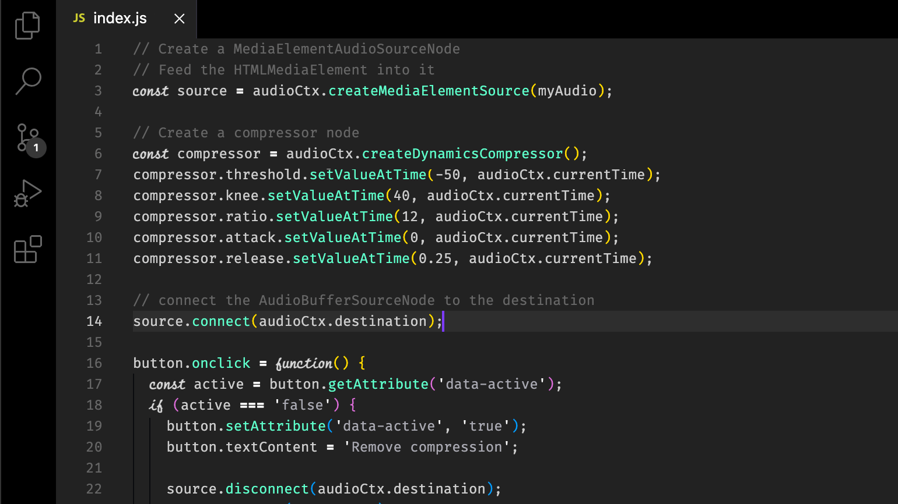

# Dark Energy

Minimalist Color Theme for VSCode

## Recommended Editor Settings:

"editor.fontFamily": "Fira Code iScript",
"editor.fontSize": 15

## Alternative font:

DejaVu Sans Mono

## Notes:

- Designed primarily for Javascript / Typescript. YMMV
